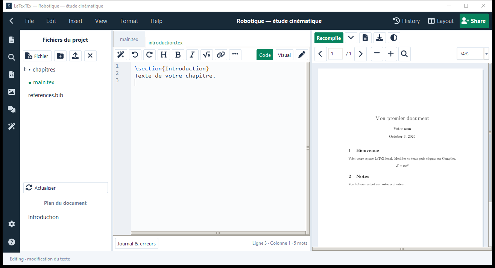

# LaTexTEx 2

**A local LaTeX editor for Windows with project management, code and visual editing, integrated PDF preview, and SyncTeX navigation.**



## Installation depuis GitHub

Prérequis : Windows, Python 3.13 avec Tkinter, et MiKTeX ou TeX Live pour compiler les documents.

Téléchargez le dépôt (Code → Download ZIP), extrayez-le et ouvrez un terminal dans le dossier :

```powershell
python -m pip install -r requirements.txt
python project_studio.py
```

Vous pouvez aussi lancer `Demarrer.cmd` après l’installation des dépendances.
Les versions exécutables, si proposées dans GitHub Releases, se téléchargent séparément ; le dossier `dist` n’est pas inclus dans le dépôt source.

Pour construire l’exécutable Windows :

```powershell
python -m pip install -r requirements-dev.txt
.\Construire.ps1
```

Les documents personnels, préférences locales et fichiers temporaires de compilation sont exclus du dépôt. L’exemple `documents/Bienvenue.tex` est inclus.

## Présentation

## Nouveautés : modèles et outils de rédaction

- Galerie de neuf modèles à l’accueil : article, document vide, rapport, présentation, CV, mémoire/thèse, rapport de stage, examen et article arabe.
- Le modèle arabe configure le sens de lecture via Polyglossia et utilise XeLaTeX avec Amiri, ou Arial si Amiri est absent. Le menu Insert permet aussi d’activer l’arabe dans un document existant sans configuration de langues préalable. Les packages LaTeX requis doivent être installés. Le mode Code conserve les commandes LaTeX ; le rendu arabe se vérifie dans le PDF.
- Images : largeur de 10 à 100 % de la ligne et légende facultative, copie dans le projet sans écraser une image existante.
- Tableaux : grille éditable, jusqu’à 30 lignes et 8 colonnes, légende et échappement automatique des caractères spéciaux.
- History : sauvegarde manuelle des fichiers texte, comparaison avec la version actuelle et restauration avec conservation du contenu précédent. Les copies complètes de projets restent accessibles par Actions du projet → Dupliquer.

`python verify_templates.py` compile les neuf modèles et vérifie les dialogues de création arabe, tableaux et historique.

Application locale Windows avec accueil des projets, éditeur multi-fichiers et aperçu PDF intégré, inspirée de la navigation d’Overleaf.

L’interface utilise une navigation sombre, un espace de travail clair et des boutons avec états de survol et navigation au clavier. Les actions secondaires sont regroupées dans les menus Importer, Actions du projet et Projet. Les options de compilation sont dans Paramètres de compilation. Le journal est replié par défaut, accessible via Journal & erreurs et affiché automatiquement en cas d’échec.

Version Windows : double-cliquez sur le raccourci **LaTexTEx** du Bureau ou cherchez **LaTexTEx** dans le menu Démarrer. L’exécutable et ses bibliothèques sont installés dans `%LOCALAPPDATA%\Programs\LaTexTEx`. Aucun terminal ni installation Python séparée n’est nécessaire pour lancer cette version.

Créez ou ouvrez un fichier `.tex`, enregistrez-le, puis cliquez sur **Compiler** (F5). MiKTeX ou TeX Live reste nécessaire pour la compilation.

Pour lancer la version source, utilisez **Demarrer.cmd**. Le script **Installer.ps1** installe la version construite depuis `dist\LaTexTEx` et crée les deux raccourcis.

- Accueil : rechercher, trier, créer, renommer, dupliquer, archiver et restaurer les projets.
- Nouveau projet crée immédiatement un dossier et un `main.tex`. Modèles : article, document vide, rapport et présentation.
- Import de dossiers locaux et de projets ZIP Overleaf ; export ZIP et PDF.
- Arborescence complète : créer fichiers/dossiers, importer des ressources, renommer, corbeille et restauration.
- Onglets indépendants avec coloration LaTeX, numéros de ligne et annuler/rétablir.
- Autosave toutes les 2 secondes, historique des versions précédentes et restauration.
- Recherche dans le projet et remplacement dans l’onglet actif.
- Plan du document avec navigation vers les sections, complétion Ctrl+Espace et insertion de snippets LaTeX.
- Commentaires locaux attachés à un fichier et une ligne, avec résolution / réouverture.
- Préférences persistantes : taille du texte, autosave et retour à la ligne.
- Synchronisation SyncTeX : Ctrl+Entrée du code vers le PDF, Ctrl+clic du PDF vers le code, après compilation.
- PDF à droite avec pages précédente/suivante et zoom.
- Journal de compilation, erreurs cliquables, arrêt et compilation automatique optionnelle.
- Choix de pdfLaTeX, XeLaTeX ou LuaLaTeX.
- Choix du document principal, compilation multi-fichiers et bibliographies BibTeX/Biber (détection automatique ou choix manuel).
- La compilation conserve le dernier PDF réussi si le nouveau code contient une erreur.

Les nouveaux projets sont enregistrés dans `user-data/projects` à côté de l’exécutable. Les dossiers importés sont utilisés à leur emplacement original. L’index est enregistré dans `user-data/projects.json` ; les anciennes entrées de `workspace.json` sont migrées au premier lancement.

Les versions, fichiers retirés et fichiers de compilation sont stockés dans `.latextex` à l’intérieur du projet. L’export ZIP exclut ces données internes. Le PDF final est aussi copié à côté du document principal. Une mise à jour conserve les documents existants et `user-data`.

Cette version est locale : elle ne fournit pas la collaboration en ligne, les commentaires partagés, la connexion au compte Overleaf ou la connexion à un service IA. Le mode Visual permet d’éditer le texte, les titres, le gras et l’italique ; les blocs LaTeX avancés sont conservés et se modifient en mode Code.

## Dépendances

Python 3.13, Tkinter, Pillow, PyMuPDF (dans `.vendor`), MiKTeX ou TeX Live. MiKTeX peut demander internet pour télécharger des packages manquants.

## Raccourcis

Ctrl+N : nouveau projet / fichier · Ctrl+O : ouvrir · Ctrl+S : tout sauvegarder · Ctrl+F / Ctrl+H : rechercher / remplacer · Ctrl+Espace : complétion · Ctrl+Entrée : code vers PDF · Ctrl+clic PDF : PDF vers code · F5 : compiler · F11 : plein écran.

## Vérification / construction

`python -m unittest test_projects.py` vérifie les projets, versions, corbeille, migration et ZIP. `python verify_projects.py` teste les vrais boutons de création, onglets, une compilation multi-fichiers avec BibTeX et la conservation du PDF en cas d’erreur. `Construire.ps1` construit l’application Windows ; `Installer.ps1` l’installe.

## Options de l’éditeur

Menus File, Edit, Insert, View, Format et Help ; barre latérale fichiers/recherche/journal/images/commentaires ; modes Code/Visual et Editing/Viewing ; mises en page éditeur/PDF ; liens, symboles, tableaux, images, citations et références. Le PDF propose Recompile, paramètres, téléchargement, mode sombre, pages et zoom en pourcentage. Share exporte un ZIP ou PDF local. Upgrade décrit la version locale gratuite. L’assistant fait des vérifications syntaxiques locales.

`python verify_options.py` vérifie la conservation du code avancé, l’édition visuelle, la sauvegarde, la lecture seule, Layout, le zoom et le mode sombre.

## Icônes

Les icônes de l’interface proviennent de Font Awesome Free 6.7.2, téléchargé depuis https://github.com/FortAwesome/Font-Awesome/tree/6.7.2. La police officielle et sa licence sont incluses dans assets/fontawesome. Elles fonctionnent hors ligne et sont rendues avec anticrénelage.

## Touchpad PDF

Ctrl + défilement à deux doigts (ou molette) zoome le PDF en gardant la position sous le pointeur. Deux doigts seuls font défiler ; Shift permet le défilement horizontal. Les petits deltas de touchpad sont conservés. L’option « Zoom PDF avec deux doigts, sans Ctrl » dans Préférences est persistante et remplace alors le défilement vertical par le zoom sur le PDF. Les gestes de pincement fonctionnent si le pilote Windows les traduit en Ctrl+molette ; leur émission dépend du matériel/pilote.

## Visual — document et formules

Visual affiche une page continue avec texte en police de document, titres, numéros de lignes, maths en ligne et équations rendues par le compilateur LaTeX local. Les références restent attachées au code. Double-cliquez une formule/un bloc pour éditer son LaTeX dans une petite fenêtre, ou le titre pour modifier titre/auteur/date. Les insertions de la barre d’outils suivent le curseur Visual et conservent ce mode. Les aperçus sont asynchrones, mis en cache dans `.latextex/visual-cache` et ne modifient pas le PDF principal. Un bloc invalide ou un package absent affiche un lien de modification ; les constructions avancées restent du LaTeX. `verify_visual_v2.py` vérifie le rendu réel et la conservation des données.
